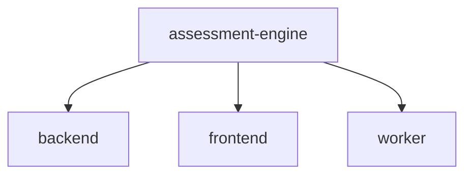
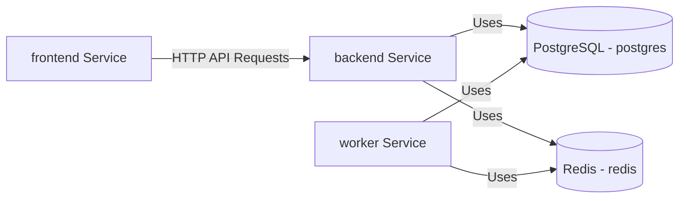
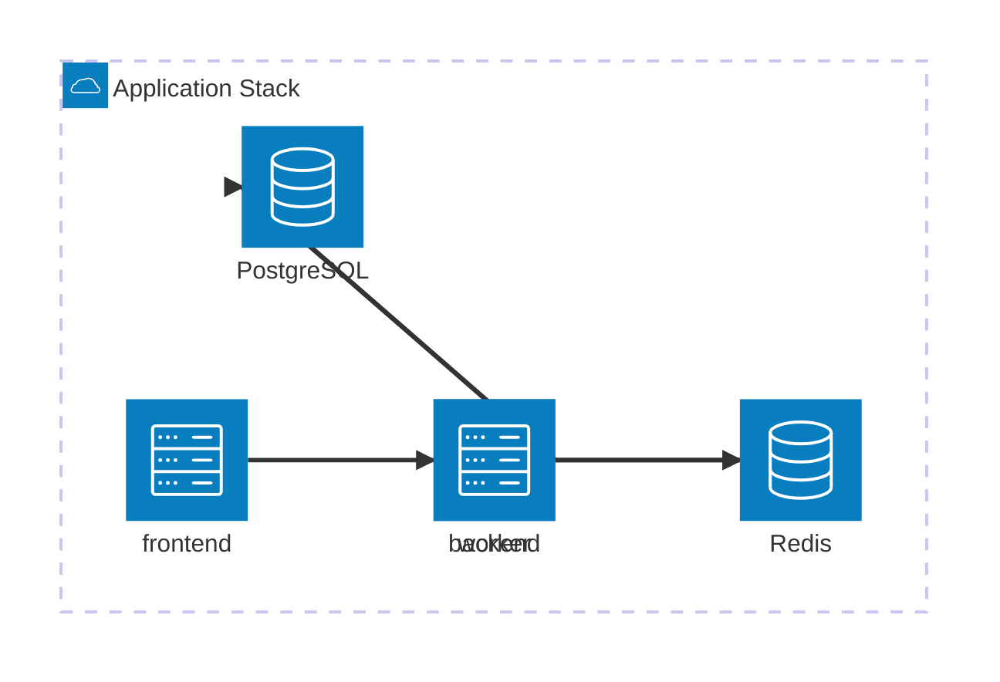

# Assessment-engine - Autonomous Repository


> **Notice**: This repository is autonomously self-documenting. The architecture, diagrams, and this README are continuously generated by AI and CI/CD pipelines.

## Project Overview

Autonomous self-documenting repository.

## Repository Structure

This is a monorepo containing the following workspaces:

- **`backend/`**: Assessment Engine Backend
- **`frontend/`**: Workspace directory
- **`worker/`**: Assessment Engine Evaluation Worker

## Technology Stack

```json
[
  "@monaco-editor/react",
  "@radix-ui/react-accordion",
  "@radix-ui/react-dialog",
  "@radix-ui/react-dropdown-menu",
  "@radix-ui/react-slot",
  "@radix-ui/react-tabs",
  "@radix-ui/react-toast",
  "@radix-ui/react-tooltip",
  "@tailwindcss/vite",
  "@testing-library/jest-dom",
  "@testing-library/react",
  "@types/react",
  "@types/react-dom",
  "@vitejs/plugin-react",
  "@vitest/coverage-v8",
  "bullmq",
  "eslint-plugin-react-hooks",
  "eslint-plugin-react-refresh",
  "express",
  "express-rate-limit",
  "ioredis",
  "jest",
  "lucide-react",
  "nodemon",
  "pg",
  "pg-hstore",
  "puppeteer",
  "react",
  "react-chartjs-2",
  "react-dom",
  "react-router-dom",
  "sequelize",
  "tailwind-merge",
  "tailwindcss",
  "vite",
  "vitest"
]
```

## AI Documentation & Insights

> **Note:** The AI documentation agent requires an OPENAI_API_KEY to generate deep insights. The following is a fallback summary.

## Architectural Overview

The `assessment-engine` repository consists of 3 services:
- **backend**: depends on postgres, redis
- **frontend**: depends on 
- **worker**: depends on postgres, redis

## Recent Code Changes

- docs: auto-generate repository documentation and diagrams [skip ci] (cd2c3a5)
- docs: auto-generate repository documentation and diagrams [skip ci] (8ed9974)
- docs: auto-generate repository documentation and diagrams [skip ci] (2f99534)
- docs: auto-generate repository documentation and diagrams [skip ci] (2336b1f)
- feat: Add Student AI Mentor and AI Question Generator features (2127d62)

## Infrastructure

- **postgres** (PostgreSQL)
- **redis** (Redis)

## Live Architecture Diagrams

## Repository Workspaces



## Service Dependencies Map



## Infrastructure Diagram




## Setup & Deployment Instructions

### Quick Start (Docker)

1. Ensure Docker and Docker Compose are installed.
2. Run the full stack:
   ```bash
   docker compose up -d
   ```

### Local Development

1. **Install Dependencies**
   ```bash
   npm install
   ```
2. **Infrastructure**
   Ensure the following are running: PostgreSQL, Redis.
3. **Start Services**
   ```bash
   npm run start --workspace=backend
   npm run dev --workspace=frontend
   npm run start --workspace=worker
   ```

## Contribution Guide

This repository is maintained automatically. When opening a Pull Request:
1. Make your code changes in the appropriate workspace.
2. Do **not** manually update the README or architecture diagrams.
3. The CI/CD `repository-automation.yml` workflow will automatically detect your changes, update the architecture graph, rebuild diagrams, and update this README upon merge.
