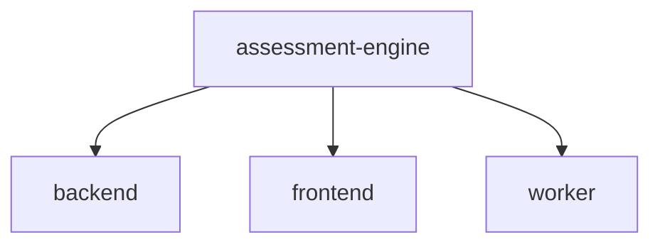
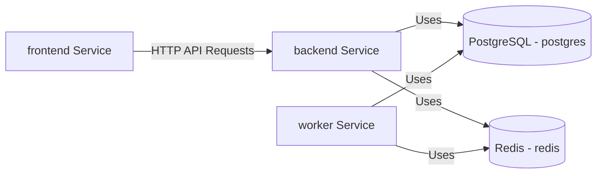
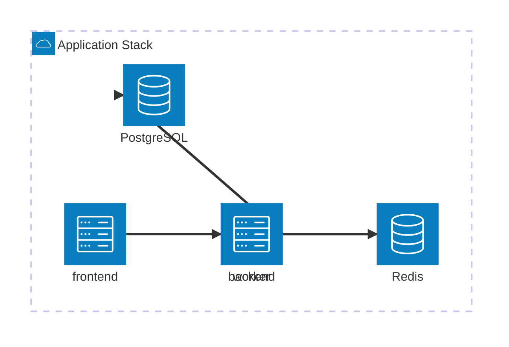

# System Architecture Diagrams

*(Auto-generated based on codebase analysis)*

## Repository Workspaces

```mermaid
graph TD;
    Root["assessment-engine"]
    backend["backend"]
    Root --> backend
    click backend "../backend" "Go to backend directory"
    frontend["frontend"]
    Root --> frontend
    click frontend "../frontend" "Go to frontend directory"
    worker["worker"]
    Root --> worker
    click worker "../worker" "Go to worker directory"
```

## Service Dependencies Map

```mermaid
graph LR;
    postgres[(PostgreSQL - postgres)]
    redis[(Redis - redis)]
    backend["backend Service"]
    click backend "../backend" "View source"
    backend -->|Uses| postgres
    backend -->|Uses| redis
    frontend["frontend Service"]
    click frontend "../frontend" "View source"
    frontend -->|HTTP API Requests| backend
    worker["worker Service"]
    click worker "../worker" "View source"
    worker -->|Uses| postgres
    worker -->|Uses| redis
```

## Infrastructure Diagram

```mermaid
architecture-beta
    group app(cloud)[Application Stack]
    service backend(server)[backend] in app
    service frontend(server)[frontend] in app
    service worker(server)[worker] in app
    service postgres(database)[PostgreSQL] in app
    service redis(database)[Redis] in app
    backend:R --> L:postgres
    backend:R --> L:redis
    frontend:R --> L:backend
    worker:R --> L:postgres
    worker:R --> L:redis
```

